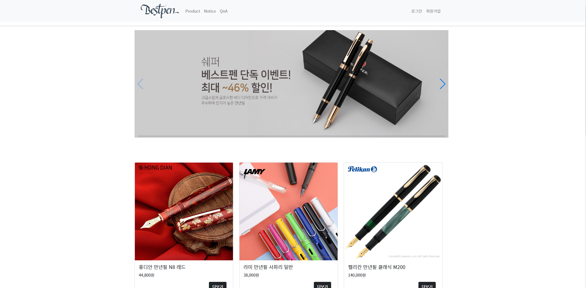
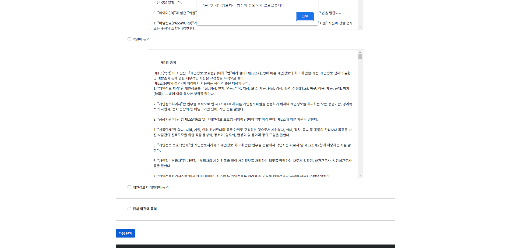
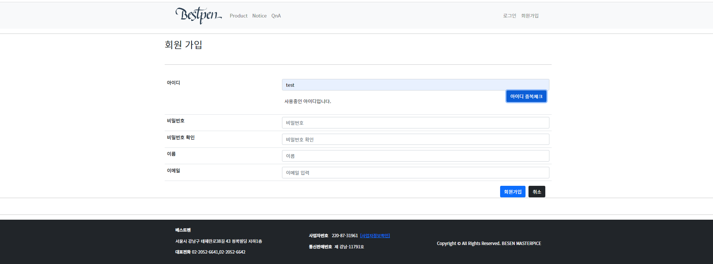
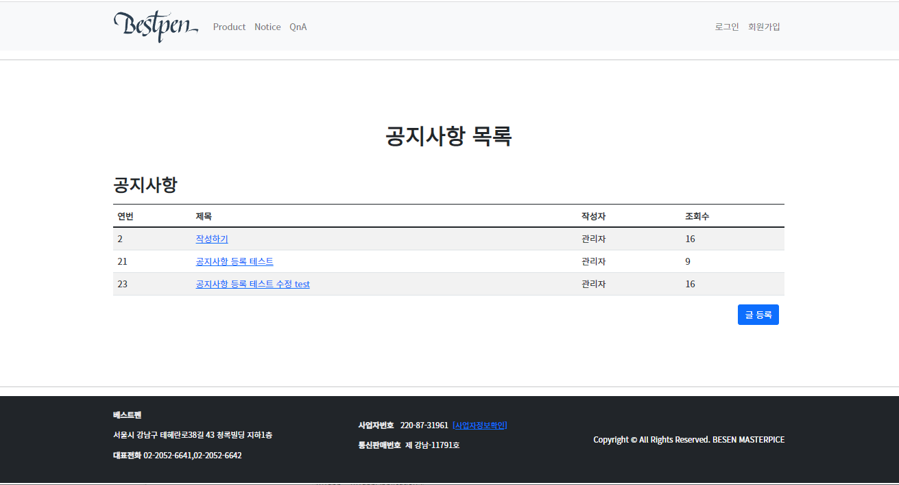

# BEST PEN 웹 어플리케이션
Spring Boot Maven+Oracle+Mybatis+Thymeleaf

## :clipboard: 프로젝트 개요

- "BEST PEN" 라는 기업을 주제로 진행한 Spring Boot 프로젝트
-  Maven으로 빌드하였으며, AJAX, MyBatis 등을 활용하여 회원가입, 로그인, 게시판 글 작성, 수정, 삭제 등의 기능 구현

## ⚙ 개발 환경
- 운영체제 : Windows 10
- 개발환경(IDE) : STS4
- JDK 버전 : JDK 1.8
- 데이터 베이스 : Oracle
- 빌드 툴 : Maven
- 관리 툴 : GitHub

## 🛠Dependencies
- Lombok
- OracleDB Driver
- Mybatis
- Inject
- Servlet
- junit
- Thymeleaf

## DB 설계

## 💻기능 구현

### 메인 페이지

### 회원 페이지

### 공지사항 페이지

